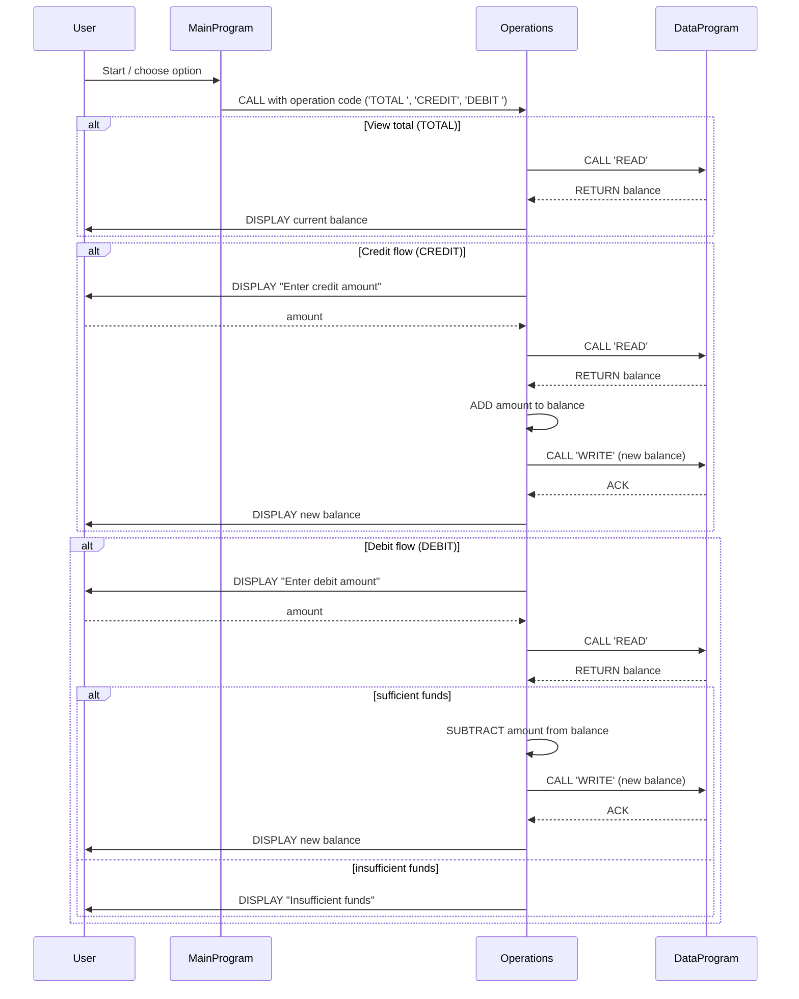

# COBOL Source Overview

This document explains the purpose of each COBOL source file in `src/cobol/`, lists the key routines, and summarizes business rules related to student account handling.

## Files

- `src/cobol/data.cob`:
  - Program ID: `DataProgram`
  - Purpose: Acts as the in-memory data holder for the account balance and provides a simple read/write interface.
  - Key routine behavior: Accepts two linkage parameters (`PASSED-OPERATION`, `BALANCE`). When `PASSED-OPERATION` = `READ` it moves the internal `STORAGE-BALANCE` into the passed `BALANCE`. When `PASSED-OPERATION` = `WRITE` it updates `STORAGE-BALANCE` from the passed `BALANCE`.
  - Notes: `STORAGE-BALANCE` is initialized to `1000.00` in working storage and is not persisted to disk.

- `src/cobol/main.cob`:
  - Program ID: `MainProgram`
  - Purpose: Simple command-line menu loop for interacting with the account system.
  - Menu options: 1) View Balance, 2) Credit Account, 3) Debit Account, 4) Exit.
  - Key behavior: Calls the `Operations` program with a fixed-width 6-character operation code (`TOTAL `, `CREDIT`, `DEBIT `).

- `src/cobol/operations.cob`:
  - Program ID: `Operations`
  - Purpose: Implements the core account operations (viewing total, crediting, debiting) and coordinates reads/writes with `DataProgram`.
  - Key behaviors:
    - `TOTAL `: Calls `DataProgram` with `READ` to retrieve `FINAL-BALANCE` and displays the current balance.
    - `CREDIT`: Prompts for an amount, `ACCEPT`s it into `AMOUNT`, reads the current balance, adds the amount, writes the new balance using `DataProgram` `WRITE`, and displays the updated balance.
    - `DEBIT `: Prompts for an amount, `ACCEPT`s it into `AMOUNT`, reads the current balance, and only performs the subtraction and write-back if `FINAL-BALANCE >= AMOUNT`; otherwise displays an "Insufficient funds" message.

## Data formats and limits

- Monetary fields use `PIC 9(6)V99` (six digits integer part, two decimal places). Maximum representable value is `999999.99`.
- `AMOUNT` and balances are numeric PIC fields—user input is accepted via `ACCEPT` and there is no explicit input validation or parsing/formatting logic in the sources.

## Business rules (student accounts)

- Initial balance: Accounts start with a default balance of `1000.00` (set in `DataProgram` / `FINAL-BALANCE`).
- Credits: Any credited amount is simply added to the current balance; there is no upper-bound validation or fees.
- Debits: A debit is only allowed if the account has sufficient funds; no overdrafts are permitted. If the debit amount exceeds the balance, the transaction is rejected with a message.
- Persistence: Balances are stored in working-storage variables and therefore are volatile for process lifetime; there is no persistent database or file storage in the current implementation.
- Operation codes: Operation names are fixed-width 6-character strings, so callers and callee must match spacing exactly (e.g., `TOTAL `, `DEBIT `).
- Input validation: There is no validation for numeric input format, sign, or negative amounts; invalid or malformed input may produce unpredictable behavior.
- Concurrency & audit: There is no locking, transaction log, or audit trail—concurrent updates or multi-user scenarios are not supported.

## Quick notes for maintainers

- To modernize or harden this system consider:
  - Adding input validation and parsing for `ACCEPT`ed amounts.
  - Persisting balances to a file or database instead of `WORKING-STORAGE`.
  - Normalizing operation codes to avoid space-padding issues.
  - Adding transaction logging and simple concurrency controls.

---
Generated from the COBOL sources in `src/cobol/`.

## Sequence Diagram

The following Mermaid sequence diagram shows the runtime data flow between the user, `MainProgram`, `Operations`, and `DataProgram` for the three main flows: view total, credit, and debit.

